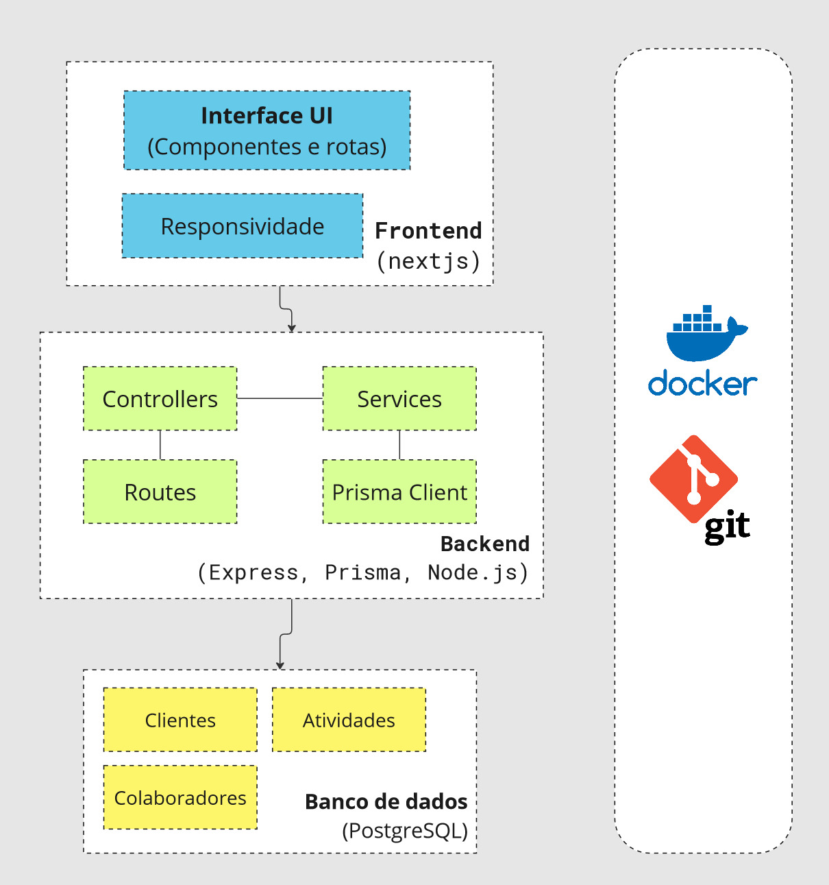
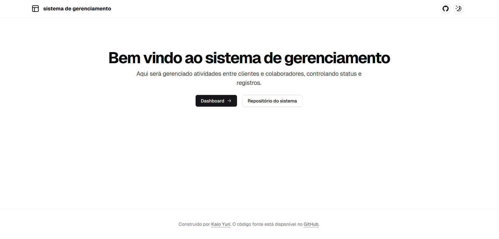
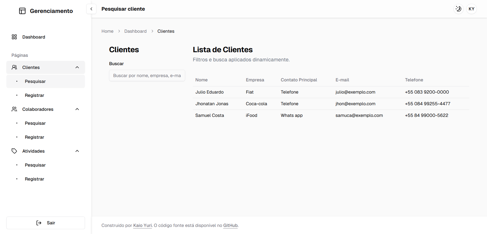
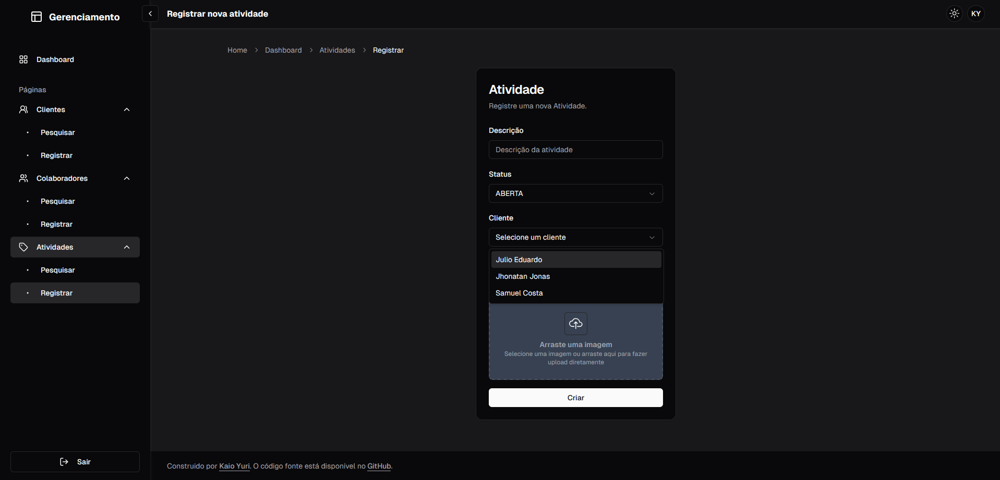
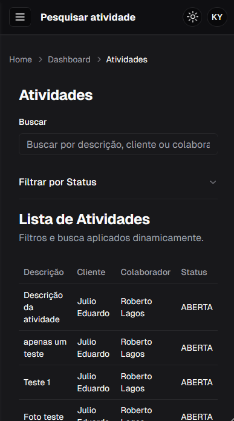
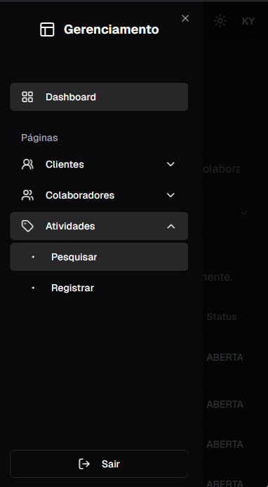

# [Sistema de gerenciamento]() &middot; [](https://kaioyuri.vercel.app)

Sistema de gerenciamento construido com [shadcn/ui](https://ui.shadcn.com) completo com responsividade para ambientes mobile e desktop.
Feito para um processo seletivo.

## Arquitetura
No projeto foi utilizada a seguinte arquitetura abaixo como base:

#### No backend:

Eu dividi a API do backend em controllers, services e routes para melhorar a organização, manutenção e escalabilidade do código.
- `Routes`: Definem as rotas e direcionam as requisições para os controladores correspondentes, mantendo a lógica de roteamento separada.
- `Controllers`: Centralizam a lógica de tratamento de requisições, gerenciando a interação entre as rotas e os serviços.
- `Services`: Contêm a lógica de negócios e operações específicas, desacoplando-a dos controladores para facilitar testes e reaproveitamento de código.
- `Prisma Client`: É uma ferramenta para interagir com o banco de dados na aplicação de forma eficiente e simplificada. Ele é um ORM (Object-Relational Mapping) que permite, Consultar dados, Gerenciar relações, Validar e Abstrair queries complexas.

#### No frontend:
- Foram utilizados componentes e elementos UI para deixar a aplicação dinamica e moderna, além de ter `tipagem` dos dados e `services` para a comunicação com o backend.


#### No Banco de dados:
- Criados as tabelas baseado nos models do prisma:
```prisma
generator client {
  provider = "prisma-client-js"
}

datasource db {
  provider = "postgresql"
  url      = env("DATABASE_URL")
}

enum Status {
  ATIVO
  INATIVO
}

enum StatusAtividade {
  ABERTA
  CONCLUIDA
}

model Cliente {
  id                Int        @id @default(autoincrement())
  nome              String
  empresa           String
  contatoPrincipal  String
  email             String     @unique
  telefone          String
  atividades        Atividade[]
  createdAt         DateTime   @default(now())
  updatedAt         DateTime   @updatedAt
}

model Colaborador {
  id            Int          @id @default(autoincrement())
  nome          String
  cargo         String
  email         String       @unique
  status        Status
  atividades    Atividade[]
  createdAt     DateTime     @default(now())
  updatedAt     DateTime     @updatedAt
}

model Atividade {
  id            Int          @id @default(autoincrement())
  descricao     String
  status        StatusAtividade
  colaborador   Colaborador   @relation(fields: [colaboradorId], references: [id])
  colaboradorId Int
  cliente       Cliente       @relation(fields: [clienteId], references: [id])
  clienteId     Int
  fotos         String[]
  createdAt     DateTime      @default(now())
  updatedAt     DateTime      @updatedAt

  @@index([colaboradorId, clienteId])
}

```


## Screenshots

Algumas imagens da aplicação:

1. Home (desktop):


2. Pesquisa (desktop):


3. Registrar atividade (desktop / tema preto):


4. Pesquisar atividade (mobile / tema preto):


5. Sidebar (mobile / tema preto):



## Features

- Barra lateral retrátil, mini e larga
- Menu da barra lateral com rolagem
- Menu em estilo "sheet" para dispositivos móveis
- Menu agrupado com rótulos
- Submenu recolhível
- Lista de itens do menu extraída
- Formulário de registro de atividades (com upload de imagem), clientes e colaboradores.
- Tabela de pesquisa com filtro para atividades, clientes e colaboradores.


## Techs/frameworks usados no backend

- **Node.js**: Plataforma popular para backend, permitindo usar JavaScript tanto no frontend quanto no backend, com alta performance e escalabilidade.
- **Express**: Framework minimalista que facilita a criação de APIs e servidores web, proporcionando flexibilidade e simplicidade.
- **Prisma**: ORM moderno que simplifica a interação com bancos de dados, com foco em segurança e agilidade na manipulação de dados.
- **PostgreSQL**: Banco de dados relacional robusto, ideal para aplicações que exigem consistência, integridade e escalabilidade de dados.

## Techs/frameworks usados no frontend

- **Next.js 14**: Framework React com renderização do lado do servidor (SSR) e otimização automática de desempenho, ideal para SEO e alta performance.
- **TypeScript**: Linguagem que adiciona tipagem estática ao JavaScript, melhorando a qualidade e a manutenção do código.
- **Shadcn/ui**: Biblioteca de componentes de UI com design moderno e altamente usável, acelerando o desenvolvimento de interfaces.
- **Tailwind CSS**: Framework de CSS baseado em utilitários que facilita a criação de designs responsivos e personalizados de forma rápida.
- **Lucid-react**: Biblioteca de componentes prontos e otimizados para React, com foco em agilidade e consistência na interface.
- **Radix UI**: Coleção de componentes acessíveis e personalizáveis para React, priorizando a usabilidade e a flexibilidade.
- **Zustand**: Biblioteca simples e eficiente para gerenciamento de estado em React, sem necessidade de boilerplate complexo.
- **Axios**: Biblioteca para requisições HTTP, que facilita a integração entre o frontend e o backend de forma simples e configurável.
- **Zod**: Biblioteca para validação de esquemas em TypeScript, garantindo a segurança e consistência dos dados antes de seu uso.


## Instalação

### Requisitos

Esta aplicação utiliza `docker` para sua execução, então se você estiver no windows, é necessário baixar o `WSL` e em seguida
o [docker desktop](https://www.docker.com/products/docker-desktop/). Para usuários do linux basta apenas ter o `docker` e `docker-compose`.

### Executando o projeto

No diretório a sua escolha você irá:

1. Clonar o repositório
   ```bash
   git clone https://github.com/KaioYuri/sistema-gerenciamento.git
   ```

2. Abrir o repositório local:
   ```bash
   cd ./sistema-gerenciamento/
   ```
3. Executar o docker-compose
   ```bash
    docker-compose up --build
   ```

4. Va para a URL `http://localhost:3001/` onde estará o frontend. Já o backend estará sendo 
executado em `http://localhost:3000/`. É possível testar o retorno, das API's no proprio Browser,
`http://localhost:3000/api/atividades`. Caso deseje testar a API recomendo utilizar Postman ou Thunder Client.

### Rotas da API

1. Atividades:
- `http://localhost:3000/api/atividades`
- `http://localhost:3000/api/atividades/{id}`
- `http://localhost:3000/api/atividades/{id}/status`
- `http://localhost:3000/api/atividades/{id}/foto`

2. Clientes:
- `http://localhost:3000/api/clientes`
- `http://localhost:3000/api/clientes/{id}`

3. Colaboradores:
- `http://localhost:3000/api/colaboradores`
- `http://localhost:3000/api/colaboradores/{id}`